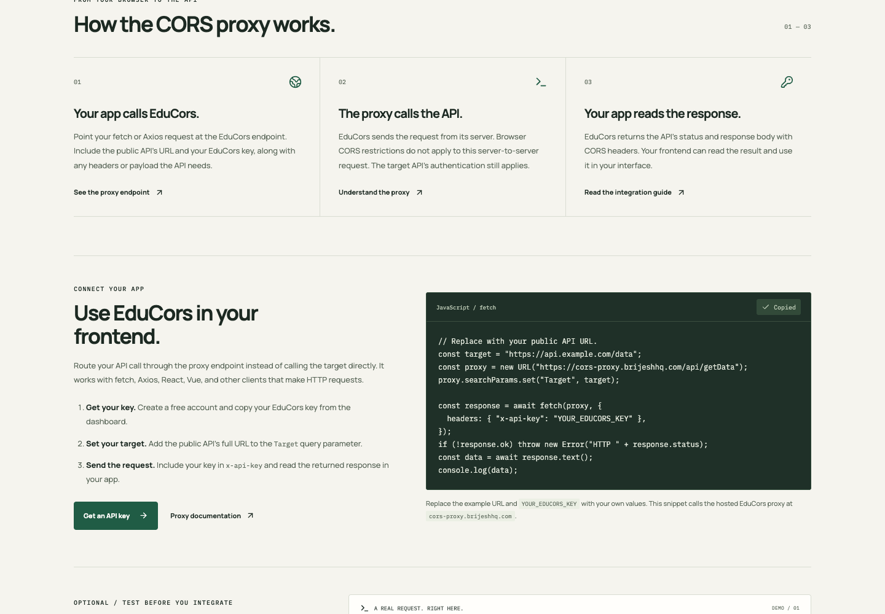
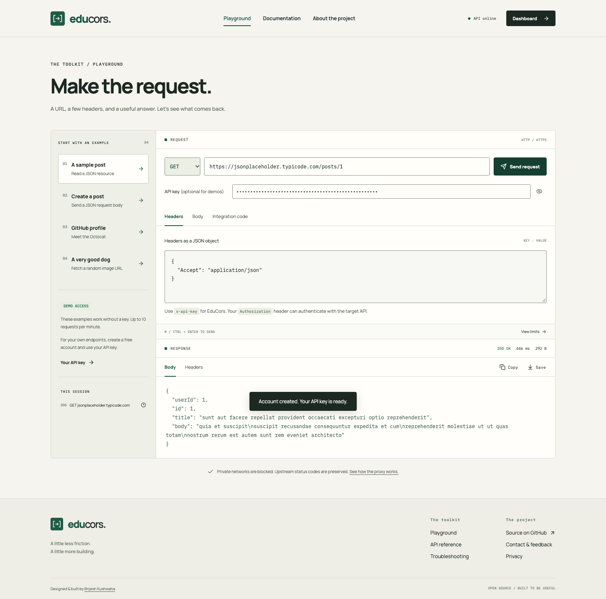

# EduCors Helper

A CORS proxy for frontend applications. Route public API requests through EduCors when browser CORS restrictions block direct calls, and read the returned response in your app. An optional playground helps you test requests, inspect responses, and generate integration code.

Built by **Brijesh Kumar Kushwaha** to make API experiments easier and help developers understand cross-origin requests.

- Website: **https://cors-proxy.brijeshhq.com/**
- Public proxy endpoint: **https://cors-proxy.brijeshhq.com/api/getData**
- Public health check: **https://cors-proxy.brijeshhq.com/api/health**



## What works

- **Public demo:** four curated GET/POST examples work without an account, limited to 10 requests per minute per IP.
- **Request playground:** edit the URL, HTTP method, headers, and body; cancel a request; inspect real status codes, headers, latency, and response size.
- **Request validation:** the exact demo URL/method pairs allow an empty key; custom requests require one. Required fields, header syntax, JSON bodies, and body sizes are checked before sending; key ownership is verified by the API.
- **Integration code:** copy cURL, JavaScript fetch, Axios, Python requests, or Go examples generated from the current request.
- **Accounts:** register, sign in, sign out, and receive an API key automatically. Passwords use bcrypt; sessions use HTTP-only cookies.
- **Key management:** reveal, copy, or rotate your own key. The previous key stops working immediately.
- **Activity:** real request counts, a seven-day UTC chart, recent average latency, and the last 30 authenticated calls.
- **Field guide:** API documentation, CORS explanations, deployment configuration, and actionable troubleshooting.
- **Responsive interface:** warm paper, dark ink, restrained green, locally hosted fonts, keyboard-accessible controls, and reduced-motion support.

The proxy supports GET, POST, PUT, PATCH, DELETE, and HEAD. Browser OPTIONS preflights are handled locally. It returns upstream status codes and bounded response bodies, including binary data.

## Run locally

Use **Node.js 22.12 or later** and **MongoDB**. Run these commands from the repository root.

```sh
npm run setup
cp BackEnd/.env.example BackEnd/.env
```

Generate a session secret, then put the result in `JWT_SECRET_KEY` inside `BackEnd/.env`:

```sh
node -e "console.log(require('crypto').randomBytes(48).toString('hex'))"
```

Start your local MongoDB service. If you prefer a separate development process:

```sh
mkdir -p .local/mongo
mongod --dbpath .local/mongo --bind_ip 127.0.0.1
```

In another terminal:

```sh
npm run dev
```

- Web interface: **http://127.0.0.1:5173**
- API: **http://127.0.0.1:9090**
- Health: **http://127.0.0.1:9090/api/health**

Vite forwards `/api` requests to the local backend. MongoDB stores accounts and activity in the database selected by `MONGO_SRV`. If account storage is unavailable, public demo requests can still work; account operations return a useful `503` error.

## API quick start

This public demo needs no key:

```sh
curl --get https://cors-proxy.brijeshhq.com/api/getData \
  --data-urlencode 'Target=https://jsonplaceholder.typicode.com/posts/1'
```

For your own permitted public endpoint:

```js
const url = new URL("https://cors-proxy.brijeshhq.com/api/getData");
url.searchParams.set("Target", "https://api.example.com/data");
const response = await fetch(url, {
  headers: {
    "x-api-key": "YOUR_EDUCORS_KEY",
    Authorization: "Bearer YOUR_UPSTREAM_TOKEN",
    Accept: "application/json",
  },
});
console.log(response.status, await response.text());
```

EduCors reads its key only from the `x-api-key` header and removes it before forwarding. `Authorization` always goes to the target API.

Copyable integration examples always use this public domain. During local development, interactive requests still use the local API through Vite's `/api` proxy. Local server URLs above are for development setup.

`Target` goes in the query string, and the request body is forwarded intact. Your payload can contain fields named `Target`, `ApiKey`, or `body` without having them removed.



## Request boundaries

| Property                   | Behavior                                                                                             |
| -------------------------- | ---------------------------------------------------------------------------------------------------- |
| Authenticated rate limit   | 120 requests/minute per account; key rotation does not reset the quota                               |
| Public demo limit          | 10 requests/minute per IP, restricted to the four preset endpoints and methods                       |
| Account attempt limit      | 15 signup/signin requests/minute per IP                                                              |
| Target protocols and ports | HTTP/HTTPS, standard ports 80/443                                                                    |
| Network checks             | Reject private, loopback, reserved, and link-local addresses, including mapped IPv6 and DNS answers  |
| DNS handling               | Validate all returned addresses and pin the connection to those answers; lookup timeout is 5 seconds |
| Redirects                  | Not followed; supply the final target URL                                                            |
| Upstream timeout           | 15 seconds after DNS validation                                                                      |
| Size limits                | 1 MB request body / 5 MB decompressed response                                                       |
| Headers                    | Strip gateway keys, cookies, browser origin metadata, and hop-by-hop headers                         |
| Response handling          | Preserve status and content type; do not forward upstream cookies; sandbox HTML responses            |
| Activity                   | Atomic increments; retain 30 recent calls; omit target query strings and payloads                    |

Rate limits are **in memory and per server process**. Multiple-instance deployments need a shared limiter before claiming a global quota. Responses are buffered rather than streamed; WebSockets and long-lived event streams are outside this tool's scope.

If you own the API, configure its CORS headers directly. A proxy does not grant access to protected APIs or replace authentication. The [MDN CORS guide](https://developer.mozilla.org/en-US/docs/Web/HTTP/Guides/CORS) explains the browser's policy.

## Tests and production build

The GitHub Actions workflow repeats the backend tests against a MongoDB service and builds the frontend on pushes and pull requests.

```sh
npm test
npm run build
```

The backend test suite uses a **temporary, isolated MongoDB process** and deterministic upstream responses. It checks authentication, ownership, revocation, CORS, rate limiting, raw bodies, binary responses, status codes, timeouts, private-network validation, pinned DNS, and concurrent accounting.

The frontend tests check required URLs and keys, exact demo matching, header validation, JSON payloads, and UTF-8 body limits using Node's test runner.

The test runner looks for `mongod` on your PATH. Use `MONGOD_BINARY` for a custom binary path. If you already run a dedicated test database, set `EDUCORS_TEST_MONGO_URI` to it; its database name must contain `test`, and it is dropped after the suite. Use a database dedicated to testing.

The frontend build is emitted to `FrontEnd/dist`. Dependencies and generated output are ignored by Git.

```sh
npm run preview --prefix FrontEnd
```

The production preview runs at **http://127.0.0.1:4174** and proxies to the same local API.

